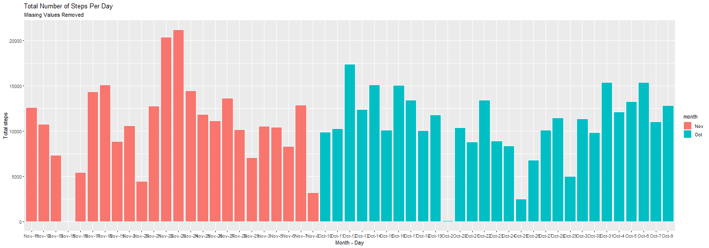
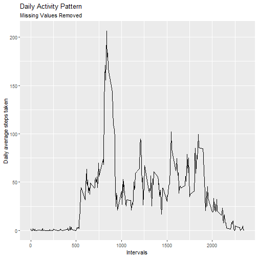
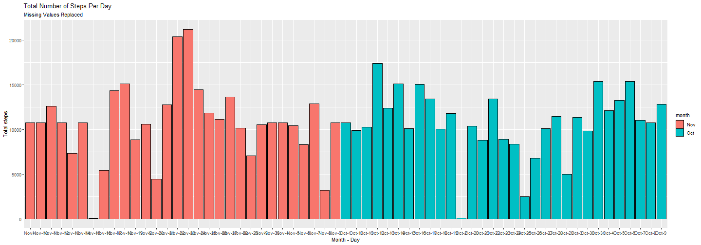
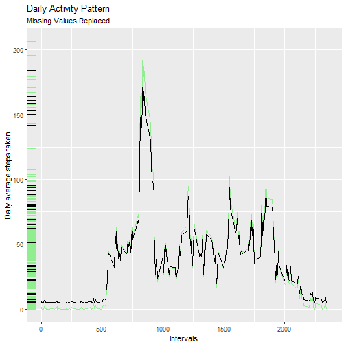
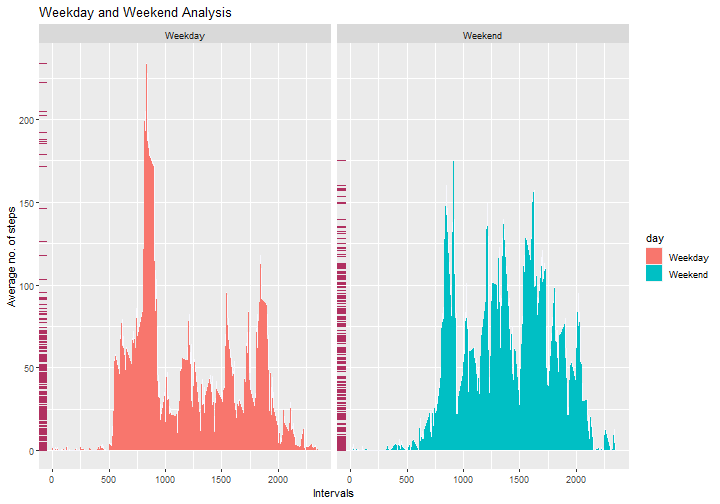

# Loading and Preprocessing the Data

First, download the data if not already done using the following code.


```r
url <- "https://d396qusza40orc.cloudfront.net/repdata%2Fdata%2Factivity.zip"
if(!file.exists('activity.csv')){
  download.file(url, destfile = "reproducible_research")
  unzip("reproducible_research")
}
```

Now we have got the file *'activity.csv'* containing the desired data.\
Read the file into RStudio.


```r
activity <- read.csv('activity.csv')
summary(activity)
```

```
##      steps            date              interval     
##  Min.   :  0.00   Length:17568       Min.   :   0.0  
##  1st Qu.:  0.00   Class :character   1st Qu.: 588.8  
##  Median :  0.00   Mode  :character   Median :1177.5  
##  Mean   : 37.38                      Mean   :1177.5  
##  3rd Qu.: 12.00                      3rd Qu.:1766.2  
##  Max.   :806.00                      Max.   :2355.0  
##  NA's   :2304
```

The data seems to be loaded correctly. Here are a few characteristics of the data:\
1. There are three variables *'steps'*, *'date'* and *'interval'*.\
2. A total of *17568* observations are recorded.

# Steps Per Day

The total number of steps taken per day are computed using the following code. It requires the packages:\
1. *dplyr*\
2. *ggplot2*\
\
It is suggested that you load them into Rstudio.


```r
#Create a dataset act2, such that it contains the total number of steps taken each day.
act2 <- activity %>% group_by(date) %>% summarise(date, total = sum(steps))

#Remove the missing values and make the values unique to dates, such that each date is present only once in the data.
act2 <- act2[complete.cases(act2), ] %>% unique()

#Look up act2, to see whether the data is desirable or not.
head(act2, 10)
```

```
## # A tibble: 10 × 2
## # Groups:   date [10]
##    date       total
##    <chr>      <int>
##  1 2012-10-02   126
##  2 2012-10-03 11352
##  3 2012-10-04 12116
##  4 2012-10-05 13294
##  5 2012-10-06 15420
##  6 2012-10-07 11015
##  7 2012-10-09 12811
##  8 2012-10-10  9900
##  9 2012-10-11 10304
## 10 2012-10-12 17382
```

\
The following code is necessary to make the data more appealing.


```r
#Necessary conversion
act2$date <- as.POSIXlt(act2$date)
act2$day_of_month <- act2$date$mday
act2$month <- months(act2$date, abbreviate = TRUE)
act2$Month_day <- paste(act2$month, act2$day_of_month, sep = '-')

#Now look at act2
head(act2, 10)
```

```
## # A tibble: 10 × 5
## # Groups:   date [10]
##    date                total day_of_month month Month_day
##    <dttm>              <int>        <int> <chr> <chr>    
##  1 2012-10-02 00:00:00   126            2 Oct   Oct-2    
##  2 2012-10-03 00:00:00 11352            3 Oct   Oct-3    
##  3 2012-10-04 00:00:00 12116            4 Oct   Oct-4    
##  4 2012-10-05 00:00:00 13294            5 Oct   Oct-5    
##  5 2012-10-06 00:00:00 15420            6 Oct   Oct-6    
##  6 2012-10-07 00:00:00 11015            7 Oct   Oct-7    
##  7 2012-10-09 00:00:00 12811            9 Oct   Oct-9    
##  8 2012-10-10 00:00:00  9900           10 Oct   Oct-10   
##  9 2012-10-11 00:00:00 10304           11 Oct   Oct-11   
## 10 2012-10-12 00:00:00 17382           12 Oct   Oct-12
```

\
The histogram showing total number of steps taken each day is made using the code below.


```r
#Create a ggplot object, a base layer to be frank.
g <- ggplot(act2, aes(Month_day, total))
g <- g + geom_histogram(stat = 'identity', aes(fill = month), color = 'ghostwhite')
g <- g + labs(title = "Total Number of Steps Per Day", subtitle = "Missing Values Removed") + xlab("Month - Day") + ylab("Total steps")
g
```



\
\
\
The mean and median for the *total steps taken each day* is easily computed using:


```r
#Mean steps each day
mean_steps <- mean(act2$total)
mean_steps
```

```
## [1] 10766.19
```

```r
#Median steps each day
med_steps <- median(act2$total)
med_steps
```

```
## [1] 10765
```

So, the mean and median for the *total steps taken each day* are **10766.19** and **10765**, respectively.

# Daily Activity Pattern

Use the following code to construct required dataframe.\


```r
#Dataframe
act3 <- activity %>% group_by(interval) %>% summarise(average = mean(steps, na.rm = T))

#Look at the data(it's a good practice)
head(act3, 10)
```

```
## # A tibble: 10 × 2
##    interval average
##       <int>   <dbl>
##  1        0  1.72  
##  2        5  0.340 
##  3       10  0.132 
##  4       15  0.151 
##  5       20  0.0755
##  6       25  2.09  
##  7       30  0.528 
##  8       35  0.868 
##  9       40  0     
## 10       45  1.47
```

```r
#The plot
f <- ggplot(act3, aes(interval, average)) + geom_line()
f <- f + labs(title = "Daily Activity Pattern", subtitle = "Missing Values Removed") + xlab("Intervals") + ylab("Daily average steps taken")
f
```



\
The above data is free of missing values. Missing Values can help to find some hidden facts about the data. It is good practice to include them in summary statistics. Let's introduce some kind of way to fill in the missing values (NA).

# Imputing Missing Values

The missing values are computed using table() function.


```r
#Report missing values
mv <- table(activity$steps, exclude = c(0:1000))
mv
```

```
## 
## <NA> 
## 2304
```

```r
#Proportion of missing values
prop <- mv/nrow(activity) 
prop
```

```
## 
##      <NA> 
## 0.1311475
```

\
Thus, there are **2304** missing values making up almost **13.11 percent** of all observations. This is a big share but it can still reveal some interesting facts.\
Let us replace the missing values with the mean number of steps taken.


```r
#create a dataframe act4
act4 <- activity

#initial look
head(act4, 10)
```

```
##    steps       date interval
## 1     NA 2012-10-01        0
## 2     NA 2012-10-01        5
## 3     NA 2012-10-01       10
## 4     NA 2012-10-01       15
## 5     NA 2012-10-01       20
## 6     NA 2012-10-01       25
## 7     NA 2012-10-01       30
## 8     NA 2012-10-01       35
## 9     NA 2012-10-01       40
## 10    NA 2012-10-01       45
```

```r
#mean of steps
mean_steps <- mean(act4$steps, na.rm = TRUE)

#replace NA values with it
act4 <- act4 %>% replace(is.na(.), mean_steps)

#look at the values
head(act4, 10)
```

```
##      steps       date interval
## 1  37.3826 2012-10-01        0
## 2  37.3826 2012-10-01        5
## 3  37.3826 2012-10-01       10
## 4  37.3826 2012-10-01       15
## 5  37.3826 2012-10-01       20
## 6  37.3826 2012-10-01       25
## 7  37.3826 2012-10-01       30
## 8  37.3826 2012-10-01       35
## 9  37.3826 2012-10-01       40
## 10 37.3826 2012-10-01       45
```

\
So, the values are replaced. Now let's make the histogram and time series plots we made previously.\


```r
#create a new dataframe
act5 <- act4 %>% group_by(date) %>% summarise(date, total = sum(steps)) %>% unique()

#create month and day_of_month and Month_day columsn
act5$date <- as.POSIXlt(act5$date)
act5$day_of_month <- act5$date$mday
act5$month <- months(act5$date, abbreviate = TRUE)
act5$Month_day <- with(act5, paste(month, day_of_month, sep = '-'))

#look at the data
head(act5, 10)
```

```
## # A tibble: 10 × 5
## # Groups:   date [10]
##    date                 total day_of_month month Month_day
##    <dttm>               <dbl>        <int> <chr> <chr>    
##  1 2012-10-01 00:00:00 10766.            1 Oct   Oct-1    
##  2 2012-10-02 00:00:00   126             2 Oct   Oct-2    
##  3 2012-10-03 00:00:00 11352             3 Oct   Oct-3    
##  4 2012-10-04 00:00:00 12116             4 Oct   Oct-4    
##  5 2012-10-05 00:00:00 13294             5 Oct   Oct-5    
##  6 2012-10-06 00:00:00 15420             6 Oct   Oct-6    
##  7 2012-10-07 00:00:00 11015             7 Oct   Oct-7    
##  8 2012-10-08 00:00:00 10766.            8 Oct   Oct-8    
##  9 2012-10-09 00:00:00 12811             9 Oct   Oct-9    
## 10 2012-10-10 00:00:00  9900            10 Oct   Oct-10
```

\
Here's the plot code.


```r
k <- ggplot(act5, aes(Month_day, total))
k <- k + geom_histogram(stat = 'identity', aes(fill = month), color = 'black')
k <- k + labs(title = "Total Number of Steps Per Day", subtitle = "Missing Values Replaced") + xlab("Month - Day") + ylab("Total steps")
k
```



\
\
\
The new data has the following characteristics.


```r
#mean
mean_steps <- mean(act5$total)
mean_steps
```

```
## [1] 10766.19
```

```r
#median
med_steps <- median(act5$total)
med_steps
```

```
## [1] 10766.19
```

\
The new data thus have **10766.19** and **10766.19** as its mean and median, resp. So, its not skewed like before.\
The time series plot code is made using the following code.


```r
#create dataframe
act6 <- act4

#transform it
act6 <- act6 %>% group_by(interval) %>% summarise(interval, average = mean(steps)) %>% unique()

#plot
a <- ggplot(act6, aes(interval, average))
a <- a + geom_rug(sides = "l")
a <- a + geom_line(data = act3, aes(interval, average), color = 'lightgreen')
a <- a + geom_rug(data = act3, color = 'lightgreen', sides = "l")
a <- a + geom_line() + labs(title = "Daily Activity Pattern", subtitle = "Missing Values Replaced") + xlab("Intervals") + ylab("Daily average steps taken")
a
```



\
Thus, the new data has slightly lower peaks than before replacing NA values. The pattern though, thus seems similar.\
\
\# Weekend and Weekday Patterns\
For this we need to find out whether the given date is a weekend or a weekday. So, using the following code, we get it.


```r
#Take activity and create a new data frame
ac <- activity

#Find out whether the necessary
ac$date <- as.POSIXlt(ac$date)
ac$day <- weekdays(ac$date)
ac$day <- factor(ac$day, levels = c("Monday", "Tuesday", "Wednesday", "Thursday", "Friday", "Saturday", "Sunday"), labels = c(rep("Weekday", 5), rep("Weekend", 2)))


#Summarise
ac <- ac %>% group_by(interval) %>% group_by(day, .add = T) %>% summarise(interval, day, average = mean(steps, na.rm = T)) %>% unique()

#look at ac
head(ac, 10)
```

```
## # A tibble: 10 × 3
## # Groups:   interval, day [10]
##    interval day     average
##       <int> <fct>     <dbl>
##  1        0 Weekday   2.33 
##  2        0 Weekend   0    
##  3        5 Weekday   0.462
##  4        5 Weekend   0    
##  5       10 Weekday   0.179
##  6       10 Weekend   0    
##  7       15 Weekday   0.205
##  8       15 Weekend   0    
##  9       20 Weekday   0.103
## 10       20 Weekend   0
```

\
Now let's create the panel plot.


```r
b <- ggplot(ac, aes(interval, average))
b <- b + geom_line(color = 'ghostwhite')
b <- b + geom_area(aes(fill = day))
b <- b + geom_rug(color = 'maroon', sides = "l")
b <- b + facet_wrap(~day)
b <- b + labs(title = "Weekday and Weekend Analysis") + xlab("Intervals") + ylab("Average no. of steps")
b
```



\
The plot shows that there is clearly more activity on weekdays compared to weekends during early hours of the day (between 500 to 1000). This could be due to people travelling to their jobs. Also the same can be seen for interval (1800, 2000).\
It is however clear that on average people are travelling more on weekends between the interval (1000, 1800). This could be due to people getting out to enjoy their weekends.
